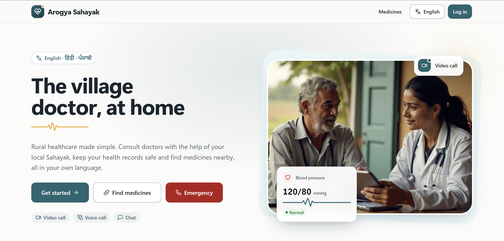

# Arogya Sahayak

A full-stack telemedicine platform for rural India. Patients consult doctors by video, voice or chat, either on their own or through a village health assistant (a *Sahayak*) who records their vitals with a digital health kit. Prescriptions are saved to the patient's health record, and a medicine finder shows which nearby pharmacies have a medicine in stock before anyone makes the trip.

The interface is available in **English, हिंदी and ਪੰਜਾਬੀ**, with voice input for people who find typing hard.

Built with **MongoDB, Express, React and Node.js (MERN)**, with TypeScript on the frontend.

## Product Preview

<table>
  <tr>
    <td width="50%"></td>
    <td width="50%"></td>
  </tr>
  <tr>
    <td width="50%"></td>
    <td width="50%"></td>
  </tr>
  <tr>
    <td width="50%"></td>
    <td width="50%"></td>
  </tr>
</table>

---

## What Arogya Sahayak Does

Arogya Sahayak models the workflow behind a real consultation (booking, queueing, claiming, treating and record-keeping) rather than a simple appointment form.

### Patients

- Book a consultation by specialty, with a chosen doctor or the **first available doctor**
- Choose video, voice or chat, now or at a scheduled time up to 30 days ahead
- One-tap **emergency**: call the free 108 ambulance, or raise an emergency case that reaches every available doctor
- Chat with the doctor, then join a private video or voice room once the consultation starts
- Keep a health record: consultation summaries with prescriptions, vitals history and uploaded reports (PDF or images)
- Maintain a medical profile (blood group, allergies, chronic conditions, emergency contact) that doctors see during consultations

### Sahayaks (village health assistants)

- Find a patient by phone number or email and book an **assisted consultation** on their behalf
- Record vitals (BP, pulse, temperature, SpO₂, blood sugar, weight), flagged as high or low for the doctor
- Track which digital-kit devices are connected today
- Follow active cases and today's activity from a dedicated dashboard

### Doctors

- An auto-refreshing **patient queue** sorted by status, then priority (emergency, high, normal), then time
- Toggle availability; open cases in their specialty, and all emergencies, appear in the queue to accept
- Start consultations, chat, update vitals and review the patient's history
- Complete a consultation with a diagnosis, structured prescription, advice and follow-up date, printable as a prescription

### Everyone

- A public **medicine finder**: search by brand name, generic name, use, or Hindi/Punjabi name, and see stock status and price per pharmacy, with call and directions links

---

## What Makes It Technically Interesting

### Race-safe doctor claiming

When two doctors accept the same open case at the same moment, a conditional atomic update (`doctor: null, status: "waiting"`) guarantees exactly one wins; the other receives a clear `409`. Every status transition (start, complete, cancel) uses the same pattern, so a consultation can't be completed twice or cancelled mid-call.

### Business rules live on the server

The UI mirrors these rules for fast feedback, but the API enforces them:

- A doctor can't be double-booked within a 15-minute slot
- A patient can't open duplicate instant consultations (emergencies are exempt)
- An offline doctor can't take instant bookings
- The doctor must practise the requested specialty
- Emergencies are never billed and can't be scheduled for later
- The fee is snapshotted at booking, so later fee changes don't affect existing consultations

### Privacy by relationship

A doctor or Sahayak can read a patient's history only if a consultation links them to that patient. Uploaded reports are stored outside any public folder and streamed through an access-checked endpoint. Serializers control exactly what each role sees: a doctor sees the patient's allergies, never their account details.

### Medicine stock you can trust

Expired batches never count as available. When a pharmacy holds several batches, the cheapest sellable one is offered. Low stock is flagged.

### Security by default

Passport sessions stored in MongoDB; the session is regenerated on login and the CSRF token rotated with it. On top of that: Helmet headers and a Content Security Policy, rate limiting on auth and chat, Joi validation with per-field errors, upload type and size limits (PDF, JPEG, PNG and WebP up to 5 MB), and `httpOnly` / `sameSite` / `secure` cookies. Video and voice calls open a Jitsi Meet room named after an unguessable per-consultation token, and the link is only returned to participants while the consultation is in progress.

### Multilingual with voice input

All UI text comes from `en`, `hi` and `pa` translation files, and a signed-in user's language choice is saved to their account. Voice input uses the browser's Web Speech API in the selected language and hides itself where unsupported. The interface is built for low-end devices and connections: every route is code-split, loading, empty and error states exist throughout, client errors (4xx) are not retried, and it uses system fonts (no font download), large touch targets, a bottom tab bar on phones, keyboard-accessible controls, reduced-motion support and print styles for records and prescriptions.

---

## Consultation Lifecycle

```text
                ┌──────────── cancel ───────────┐
                ▼                               │
  scheduled ──start──▶ in_progress ──complete──▶ completed
      ▲                    ▲
  (booked for later)       │
                        start
  waiting ─────────────────┘      waiting + no doctor = open case → a doctor accepts it
  (instant / emergency)
```

---

## Architecture

```text
                        Arogya Sahayak
                              |
               +--------------+--------------+
               |                             |
       React + TypeScript              Express 5 API
               |                             |
      Pages / Components             Middleware Layer
               |                             |
   React Query hooks / Context   Auth / Roles / CSRF / Joi / Uploads
               |                             |
               +--------------+--------------+
                              |
                         Controllers
                              |
                          Services
                     (business rules)
                              |
                    Serializers + Mongoose
                              |
                           MongoDB
```

The React client handles presentation, i18n and fast feedback. Express exposes the REST API behind a middleware layer for authentication, role guards, CSRF, validation and uploads. Controllers stay thin (parse, call a service, serialize); services hold the business rules; serializers decide what each role may see.

In development, Vite serves the frontend on `:5173` and proxies `/api` to the API on `:8080`. In production, Express also serves the built frontend, so the app deploys as **one Node service**.

---

## API Surface

All endpoints are under `/api` and return JSON. Validation errors return `400 { error, errors: { field: message } }`. Every non-GET request must send the `X-CSRF-Token` header obtained from `GET /api/session`.

| Method | Endpoint | Who | Purpose |
|---|---|---|---|
| GET | `/session` | anyone | Current user, CSRF token, reference data |
| POST | `/auth/signup` · `/auth/login` · `/auth/logout` | anyone | Authentication (rate-limited) |
| PATCH | `/profile` · `/profile/language` | signed in | Update own profile / language |
| PATCH | `/profile/availability` | doctor | Go online / offline |
| PATCH | `/profile/equipment` | sahayak | Update digital-kit status |
| GET | `/dashboard` | signed in | Role-specific stats and lists |
| GET | `/doctors?specialty=` | signed in | Doctors for booking |
| GET | `/consultations?scope=active\|past` | signed in | Own consultations (doctors also see open cases) |
| POST | `/consultations` | patient, sahayak | Book (Sahayaks pass `patientId` and vitals) |
| GET | `/consultations/:id` | participants | Details, messages, video room link |
| PATCH | `/consultations/:id/accept` | doctor | Claim an open case (race-safe) |
| PATCH | `/consultations/:id/start` · `/complete` | assigned doctor | Lifecycle transitions |
| PATCH | `/consultations/:id/vitals` | sahayak, doctor | Record vitals |
| PATCH | `/consultations/:id/cancel` | participants | Cancel while scheduled / waiting |
| POST | `/consultations/:id/messages` | participants | Chat (rate-limited) |
| GET | `/patients/lookup?q=` | sahayak, doctor | Find a patient by phone or email |
| GET | `/patients/:id/records` | care team only | Patient history |
| GET · POST | `/records` | patient | Own records / upload a report |
| GET | `/records/:id/file` | owner, care team | Download an attached file |
| DELETE | `/records/:id` | patient | Delete an own upload |
| GET | `/medicines?q=` · `/medicines/:id` | anyone | Search / pharmacy availability |

---

## Database Design

```text
User (patient | sahayak | doctor)
 |
 +----< Consultation (as patient, doctor or sahayak)
 |        |
 |        +-- vitals, prescription[], messages[]   (embedded)
 |
 +----< HealthRecord >---- Consultation (optional)

Pharmacy
 |
 +-- inventory[] >---- Medicine                    (embedded stock batches)
```

- **User:** credentials, role, preferred language and a role-specific profile (patient medical details, doctor specialization / qualification / fee / availability, Sahayak health centre and equipment)
- **Consultation:** patient, doctor, Sahayak, specialty, mode, status, priority, complaint, vitals, timestamps per transition, diagnosis, structured prescription, advice, follow-up date, fee snapshot, private room id and chat messages
- **HealthRecord:** patient, optional consultation, type (consultation, vitals, lab report, prescription, vaccination, imaging, other), notes and private file metadata
- **Medicine:** name, generic name, local names (Hindi / Punjabi), dosage form, strength, uses and prescription requirement
- **Pharmacy:** contact details, opening hours, active flag and inventory batches with quantity, price and expiry date

---

## Tech Stack

| Layer | Technology |
|---|---|
| Frontend | React 18, TypeScript, React Router 6, Vite 5 |
| Data fetching | TanStack Query 5 |
| UI | Tailwind CSS 3, Radix UI primitives (shadcn/ui), Lucide icons |
| Backend | Node.js 20+, Express 5 |
| Database | MongoDB, Mongoose 9 |
| Authentication | Passport (local), passport-local-mongoose, express-session, connect-mongo |
| Security | Helmet (CSP), express-rate-limit, CSRF tokens |
| Validation | Joi |
| File uploads | Multer (private local storage) |
| Video / voice | Jitsi Meet rooms |
| Voice input | Web Speech API |
| Testing | Node test runner, Supertest |
| Code quality | ESLint, TypeScript strict mode |

---

## Getting Started

### Requirements

- Node.js 20+
- MongoDB 6+ running locally, or a MongoDB Atlas connection string

### Installation

```bash
git clone <your-repository-url>
cd Arogya-Sahayak
npm install                                  # installs both workspaces
cp backend/.env.example backend/.env         # optional; defaults work for local MongoDB
npm run seed                                 # demo doctors, patients, pharmacies, medicines
```

### Development

```bash
npm run dev
```

| Service | URL |
|---|---|
| Frontend | `http://localhost:5173` |
| API | `http://localhost:8080` |

### Production

```bash
npm run build
npm start
```

Express serves the production React build alongside the API.

<details>
<summary>Environment variables (backend/.env)</summary>

| Variable | Default | Notes |
|---|---|---|
| `MONGO_URL` | `mongodb://127.0.0.1:27017/arogya_sahayak` | |
| `PORT` | `8080` | |
| `SESSION_SECRET` | random per start (dev only) | **Required** when `NODE_ENV=production` |
| `UPLOAD_DIR` | `backend/uploads` | Private storage for record files |
| `VIDEO_ROOM_BASE_URL` | `https://meet.jit.si` | Video / voice rooms (Jitsi Meet) |

</details>

Set `VITE_DEMO_MODE=true` when building the frontend to show the demo-account buttons in production.

---

## Demo

The seed script creates local demo accounts for every role. All of them use the password **`Arogya@123`**, and in development the login page offers one-click buttons for them.

| Role | Email | Notes |
|---|---|---|
| Patient | `patient@arogya.demo` | Ram Singh, with a past consultation, vitals and records (Punjabi UI) |
| Sahayak | `sahayak@arogya.demo` | Priya Sharma, Nabha PHC (Hindi UI) |
| Doctor | `doctor@arogya.demo` | Dr. Anjali Verma, General Medicine |

More doctors: `rajesh@`, `meera@` (pediatrics) and `harpreet@` (cardiology, offline), all `@arogya.demo`.

Demo credentials are intended for local and portfolio demonstration only.

---

## Scripts

Run from the repository root.

| Command | Purpose |
|---|---|
| `npm run dev` | API with `--watch` + Vite dev server |
| `npm run seed` | Reset and seed the development database |
| `npm test` | Backend integration tests (uses `arogya_sahayak_test`) |
| `npm run lint` | ESLint for both workspaces |
| `npm run typecheck` | Strict TypeScript check of the frontend |
| `npm run build` | Production build of the frontend |
| `npm start` | Production server (API + built frontend) |
| `npm run check` | Lint, typecheck, test and build |

### Testing

```bash
npm test
```

38 integration tests run against a real MongoDB and cover auth and CSRF, role guards, booking rules (specialty match, slot clashes, duplicate protection, schedule windows), the two-doctor accept race, the start-to-complete flow, record and file access control, upload validation and medicine stock ranking.

---

## Future Improvements

- Real-time queue and chat updates over WebSockets (the queue currently polls)
- SMS reminders for scheduled consultations and follow-ups
- Offline support for Sahayaks working with patchy connectivity
- A pharmacy-facing interface for updating stock
- Cloud object storage for uploaded reports
- Production deployment with managed MongoDB

---

## Project Scope

Arogya Sahayak focuses on the consultation workflow, health records and medicine availability.

Not included at this stage:

- Online payment processing (consultation fees are recorded, not charged)
- Pharmacy stock management through the app (pharmacy inventory comes from seed data)
- Its own video infrastructure (calls use Jitsi Meet rooms)
- Integration with national health ID systems

Chrome ships without Punjabi date data, so dates fall back to Indian English formatting when the UI is in Punjabi.

---

<details>
<summary>Project Structure</summary>

```text
Arogya-Sahayak/
├── backend/
│   ├── scripts/                 seed.js + seed-data.js (demo data)
│   ├── src/
│   │   ├── config/              env, database, passport, security headers
│   │   ├── constants/           enums shared by models, validators and /api/session
│   │   ├── controllers/         thin HTTP layer: parse → call service → serialize
│   │   ├── middleware/          auth / role guards, CSRF, validation, uploads, loaders, errors
│   │   ├── models/              User, Consultation, HealthRecord, Medicine, Pharmacy
│   │   ├── routes/              route definitions
│   │   ├── services/            consultations, records, users, medicines, dashboards
│   │   ├── utils/               AppError, serializers, dates, text helpers
│   │   ├── validators/          Joi schemas, one file per domain
│   │   └── app.js               Express app: security, sessions, CSRF, routes
│   ├── tests/
│   │   └── integration/         node:test + supertest
│   └── server.js
│
├── frontend/
│   ├── public/
│   ├── src/
│   │   ├── components/          layout, common, dashboard, consultations, booking,
│   │   │                        records, medicines, profile, ui
│   │   ├── context/             SessionContext (auth + CSRF), LanguageContext (i18n)
│   │   ├── hooks/               React Query hooks per domain, speech recognition, formatters
│   │   ├── lib/                 API client, formatting, vitals ranges, storage
│   │   ├── pages/               one file per route (lazy-loaded)
│   │   ├── translations/        en.json, hi.json, pa.json
│   │   └── types/               API response types
│   ├── index.html
│   ├── tailwind.config.ts
│   └── vite.config.ts
│
├── docs/                        product screenshots
├── LICENSE
├── package.json                 npm workspaces: backend + frontend
└── README.md
```

</details>

---

## Why This Project

Rural patients often travel hours to see a doctor, arrive without their history, and then can't find the prescribed medicine locally. Arogya Sahayak addresses each of those steps.

On the engineering side, it goes beyond appointment CRUD by solving real domain problems: concurrent case claiming, a server-enforced consultation lifecycle, emergency prioritisation, relationship-based access to health data, private file delivery, expiry-aware stock ranking and a fully translated, accessible interface. It is structured as a typed React frontend backed by a modular Express API and MongoDB, with integration tests for the rules that matter.

---

## License

Released under the [MIT License](LICENSE).